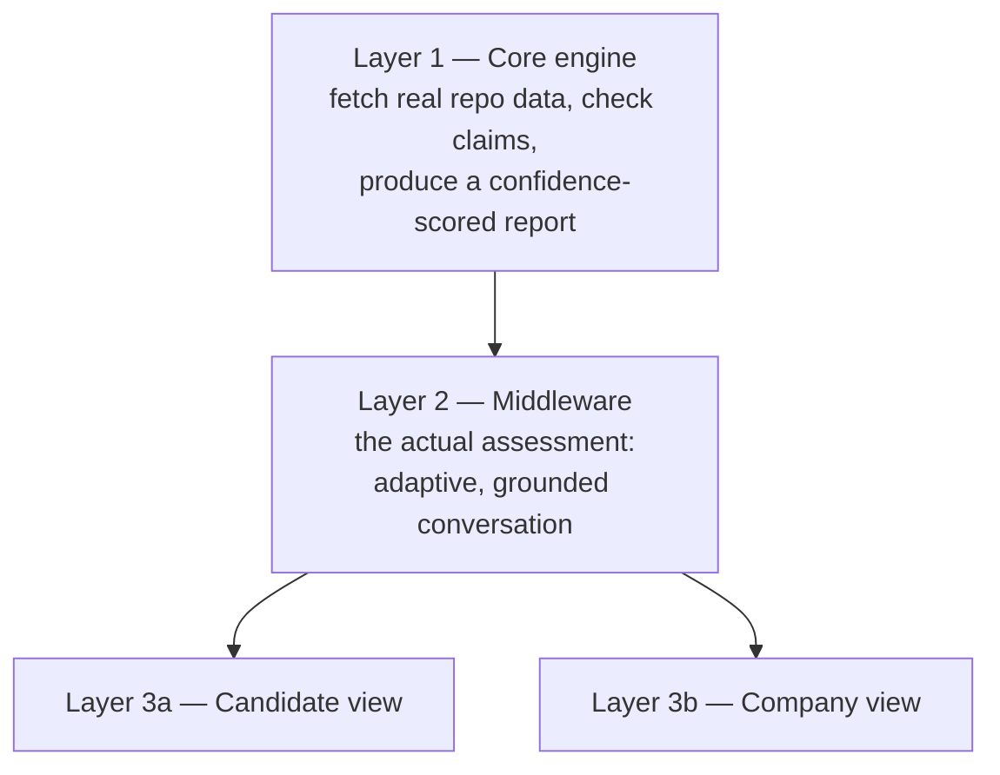

# Groundtruth — Design Doc

One system, three layers, two audiences. What we're building — and, just as importantly, what we're not.

**Track: Build It, competing for Best UI too.** AWS account verification takes longer than we have, so nothing here runs on billed cloud services. Build It's own toolkit — Strands Agents SDK, SAM CLI + LocalStack, Cedar — is real AWS technology, just running on our machine instead of in the cloud. "Built on AWS" stays fully satisfied; only the deployment story changes. Best UI is open to either track and doesn't change anything below — it just means the design-language work in `SKILL.md` gets real, dedicated build time, not an afterthought.

A naming note: internally, "Jack" means candidate and "Jill" means company — our own shorthand. That name never appears in the product, the repo, or the video. Jack & Jill is a real, funded company in this space; using their name would borrow their brand, not just their clarity.

---

## 1. What this is

Groundtruth checks whether a candidate's claims — a resume, a listed GitHub project — are true, using real evidence, before anyone reaches the interview stage. Then it has a short, adaptive, written conversation with the candidate about their own work, to prove the claims aren't just true but genuinely understood.

Everything below is that check, that conversation, or a view of the results for one of the two people who need them.

---

## 2. The shape of the system

One engine, one filter, two thin views. Not four products.

---

## 3. Layer 1 — Core engine

**What it does:**
1. Takes a claim ("I built X, using Y, this was my role") and a GitHub repo link.
2. Pulls the real data: when the repo was created, every commit and who made it, whether it's a fork and how much was actually changed, what the code really depends on.
3. Reads the *pattern* of the commits, not just the content — small, iterative, fix-and-refine commits look different from one huge one-shot dump. A signal, never a verdict on its own.
4. Checks the claim against all of it, using Bedrock — does the description plausibly match the evidence.
5. Produces a report, per claim: **verified / plausible / inconsistent / not enough evidence** — always with the specific evidence shown, never a bare number.

**AWS:** a Lambda function (via SAM CLI + LocalStack, running locally) handles the GitHub API calls and the deterministic checks. A local model, orchestrated through Strands Agents SDK, does the one step that needs judgment. S3 and DynamoDB, both LocalStack-emulated, cache responses and store the report. Detail in `TECHNICAL.md`.

This is the piece nothing else works without. It has to be solid first.

---

## 4. Layer 2 — Middleware, the actual assessment

Sits between the engine and both views. Belongs to neither side — it's the test itself.

**M.1, the flagship.** A short, adaptive, written conversation grounded in the candidate's own real repo. Starts broad on one part of the code, then follows up based on what they actually said — drills deeper if the answer was thin, moves on if it was solid. No camera, no timer, no live proctoring.

Why written, not voice or video: the adaptive logic is worth having on its own merits. The delivery stays written on purpose — questions are grounded in specific commits and lines, natural to show inline in text, awkward to narrate. It's the only version buildable in the time we have, and it doesn't put us head-to-head with funded, polished video-interview products on their own ground.

**M.2, the fallback.** If M.1 is too much to build well: one flagged commit, one written explanation, one score. Same idea, smaller.

Whichever version runs, its result folds into the same report from Layer 1 — never a separate document.

**AWS:** a Strands agent asks and grades every question, grounded in the Layer 1 report, running against a local model. DynamoDB (LocalStack) stores the full transcript as it happens. Detail in `TECHNICAL.md`.

---

## 5. Layer 3a — Candidate view

**5.1, feedback that can't become a patch list.** Once there's a result, the candidate sees real reasoning: what checked out, what looked thin, why. Two rules: tell them what we could or couldn't verify — true either way, and responding honestly takes real effort regardless. Never tell them the exact thresholds or how anything is weighed. If the static evidence alone was inconclusive, point them at the conversation as the real way to demonstrate understanding, not at a list of things to edit.

**AWS:** the local model turns stored evidence into calibrated, plain-language text. No new data collected.

---

## 6. Layer 3b — Company view

The real order a recruiter experiences this in: **6.3 first** — the whole applicant pool, ranked — then **6.1** for one candidate, then the human interview happens, then **6.2** closes it out. Numbered by function, not by order.

**6.1, the interviewer briefing.** Per candidate: the evidence-backed report, the full M.1 transcript if it ran, and specific questions to ask next — grounded in that candidate's actual commits.

**6.2, the decision record.** Why a candidate did or didn't advance, in writing, grounded in evidence — now combined with the actual human interview transcript, so the record reflects both our evidence and what was really said. Cheaper and more defensible than an ad hoc recruiter comment.

**6.3, the ranked view.** The same per-candidate report, across a whole applicant batch, one sortable table instead of a pile of resumes. The entry point of the whole company experience — build a basic version early, not as an afterthought.

**AWS:** Step Functions (LocalStack) assembles each per-candidate report; a Lambda function handles batch aggregation for 6.3; the local model writes the combined narrative for 6.2; the frontend runs on a local dev server for the demo. Detail in `TECHNICAL.md`.

---

## 7. Fairness rules — apply everywhere

- **Never penalize a small GitHub.** Only what's claimed gets checked. No claim, no check, no penalty.
- **Never penalize messy commit hygiene.** Bad commit messages are a habit, not a character flaw — a messy, iterative trail is often stronger evidence of real work than a tidy one.
- **Ambiguous evidence means "not enough evidence," never "guilty."**
- **No penalty for prior experience.** We score whether a claim is true, never who's making it.
- **Never a bare score.** Every result carries its evidence and a confidence level.
- **Rank by evidence of genuine understanding, not by how impressive a repo looks.** A small, honest, well-understood project ranks at or above a flashy one the candidate can't explain.
- **Feedback informs, it doesn't teach gaming.** What we could or couldn't verify — yes. Exact thresholds or weights — never.

---

## 8. What we will not build

Explicit, on purpose, so scope stays honest:

- No video or voice interviewing — text only.
- No candidate-to-job matching or marketplace — we verify claims, we don't recommend jobs.
- No plagiarism search against every public repository — only a fork checked against its own direct parent.
- No blockchain or credential-wallet infrastructure.
- No mobile app.
- No general resume-to-job-description matching — that's an ATS; this isn't one.
- No Cognito — it's a real, billed AWS service, off the table for Build It. If we want candidate/company role separation at all, Cedar policies are the Build-It-compatible way to do it — lowest priority, only if everything above already works.

---

## 9. Build order

1. Layer 1 + Layer 2 (M.1, or its fallback M.2) + a basic ranked view (6.3) + briefing (6.1). Smallest version that tells the whole story end to end, list to detail.
2. Add candidate feedback (5.1) and the full decision record (6.2), transcript included — cheap once step 1 exists.
3. Polish the ranked view if time is left. Step 1's basic version already covers the demo.

Before any of this: prove M.1's core loop works at all, standalone — with the actual local model we'll ship with, not a hosted one. Local-model quality is the new real risk this pivot introduces; find out early, not on day three. How we're doing that is in `SKILL.md`.
