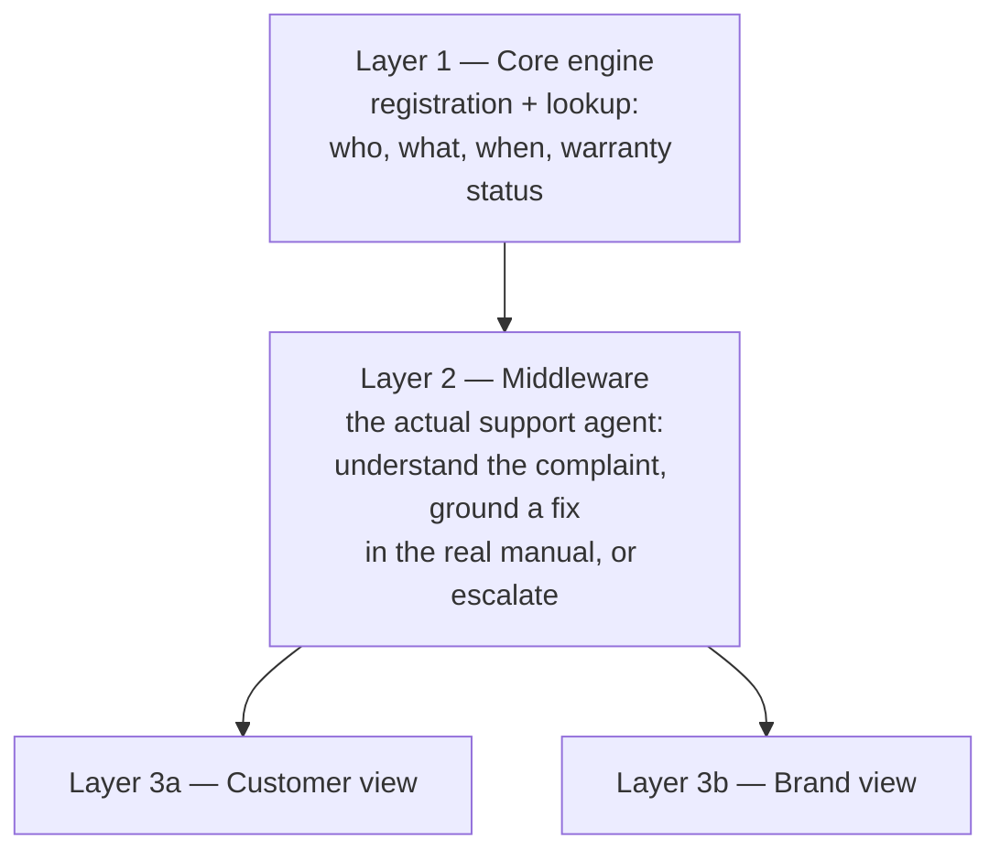

# Aftercare — Design Doc

One system, three layers, two audiences — same shape that worked for us before. What we're building, and what we're deliberately not.

**Track: Build It, competing for Best UI too.** No AWS account needed — everything below runs locally, using AWS's own open-source tooling: Strands Agents SDK (the agent), Cedar (brand-dashboard authorization), AWS SAM Local (the same API as real Lambda functions), and OpenSearch (retrieval). Full mapping in `TECHNICAL.md`, exact wiring in `FLOW.md`.

**Scope assumption: a small number of brands, fully onboarded.** We assume each brand already gave us their product catalog structure, their sales data, and their terms & conditions — the way any real integration would start. The demo runs two independent brands (an AC line and a washing-machine line) to show the model generalizes across products, not one company's whole appliance catalog under a single umbrella name. We build the complete flow end to end before considering any other scenario. One feature that runs beats five that almost do.

**Fixtures, not real data.** The product manual, the terms & conditions, and the sales records this build runs on are authored by us — realistic, not real. Same principle as simulating the WhatsApp channel: what's being demonstrated is the logic, not a claim that this is a live brand integration.

---

## 1. What this is

Aftercare knows what a customer bought the moment they message about it — no re-explaining, no screenshots of an invoice. When they describe what's wrong, in their own words, it reads that against the *actual manual for that exact product* — and the brand's own terms for coverage questions — and attempts a real, grounded fix before ever creating a ticket. If it can't resolve it, or the issue sounds urgent or unsafe, it escalates immediately with everything already gathered.

---

## 2. The shape of the system

One engine, one agent, two thin views. Not four products.

---

## 3. Layer 1 — Core engine

**What it does:**
1. Registers a product to a customer at the point of sale: who, what, when, warranty end date. No app, no form the customer fills in later — a brand uploads a batch (CSV in this build; a real integration is a later problem, not a hackathon one).
2. Looks a customer up by phone number the moment they message, and pulls every product they've registered plus their history with each.
3. Computes warranty status deterministically — active, expiring, expired. No model involved; this is arithmetic on dates.

**AWS:** the lookup and warranty math run as a real Lambda function under SAM Local (`src/lambda_handlers.py`), and as plain local Python under the Flask demo (same underlying code — see `TECHNICAL.md`/`FLOW.md`). DynamoDB-shaped storage for the records is still plain local Python (a CSV fixture, JSON files) — that part didn't get a local open-source equivalent, same reasoning as our earlier build.

This is the piece nothing else works without — has to be solid before anything else gets attention.

---

## 4. Layer 2 — Middleware, the actual support agent

Sits between the registration data and both views. This is the flagship — the one thing that makes this more than a lookup table with a chat window on top.

**What it does, in order — a real back-and-forth, not a one-shot answer:**
1. Reads the customer's free-form complaint — not a menu of canned options, whatever they actually type.
2. Checks for safety language first, before anything else (see the rule below) — this check never depends on the model choosing to notice.
3. Decides which source it needs: a coverage/warranty question retrieves from the brand's terms & conditions; a "something's wrong with it" complaint retrieves from that exact product's manual.
4. Gives the customer **one specific, doable-by-hand step** — not a wall of steps, not "have you tried turning it off and on" — grounded in what the manual actually says works for this exact symptom, and asks them to try it and report back.
5. Waits for their answer. **Fixed:** confirms and closes, logged as self-resolved, no ticket. **Still broken:** either offers the one next real step if the manual has one (capped at two self-service attempts — this isn't meant to stall someone indefinitely), or, if the symptom described matches what the manual flags as not self-fixable (e.g., a drum with mechanical play, cooling that doesn't improve after a clean filter), escalates immediately.
6. Escalates to a structured ticket with the product, history, exact issue, and exactly what was already tried and didn't work — never a guess dressed up as a third attempt.

**AWS:** the local model, orchestrated through Strands, does the reading and generation; OpenSearch (real BM25, local single-node) does the retrieval, with an honest fallback if it's unreachable. DynamoDB-shaped storage (plain JSON files) holds the full conversation, not just a final ticket.

---

## 5. Layer 3a — Customer view

A chat interface, styled like the WhatsApp conversation it's standing in for (see `TECHNICAL.md` for why it's simulated rather than the real API). Registration confirmation, the complaint conversation itself, and resolution updates once the brand responds.

---

## 6. Layer 3b — Brand view

Aftercare is a service provider, not a single company — each brand gets its own dashboard, and one brand's staff can never see another's. That boundary is enforced by a real Cedar policy evaluation (`policies/dashboard.cedar`), not an `if` in a route handler — a brand's dashboard request is a genuine authorization decision, principal (which brand's staff is logged in, simulated with a picker) against resource (which brand's data is being asked for).

**Ticket dashboard.** Every escalated complaint for *that brand only*: product, customer, full history, what the agent already tried, current status.

**Product feedback.** The thing a plain support inbox can't produce: which issue keeps recurring on which product, and how often.

**Warranty overview.** Active / expiring / expired, at a glance.

---

## 7. Honesty rules — apply everywhere, no exceptions

- **Never suggest a fix the manual doesn't actually support.** Every troubleshooting suggestion cites the specific section it came from. No citation, no suggestion.
- **Never guess on anything safety-relevant.** A described issue involving sparking, burning smell, exposed wiring, gas, or anything in that category escalates immediately, full stop — no troubleshooting attempt, ever.
- **Never promise warranty coverage.** The system states what the recorded terms say; the brand makes the actual coverage decision.
- **Never fabricate a registration that doesn't exist.** An unregistered product is an unregistered product — the agent says so and asks for what it needs, it doesn't invent a record to keep the conversation smooth.
- **When the manual doesn't clearly address the issue, say so and escalate** rather than offering a confident-sounding guess.

---

## 8. What we will not build

- No real WhatsApp Business API integration — a simulated chat UI, styled the same way, stands in for it. Getting a number approved isn't achievable in this timeframe, and the logic underneath is what's actually being demonstrated.
- No Shopify plugin or checkout-time API integration — CSV upload for registration, same as the original spec's own first version.
- No service-technician dispatch or marketplace — Aftercare produces the ticket; the brand's own team handles the visit.
- No general CRM, marketing, or sales features — post-purchase support only.
- No multi-language support in this build — a real, valuable next step, not in scope for four days.
- No real authentication. Both the customer picker and the brand-staff login are simulated identity, disclosed as such in the UI — what's real is what happens *after* identity is established (Cedar's authorization decision), not the login screen itself.

---

## 9. Build order

1. Layer 1 (registration + lookup) + Layer 2's core agent loop (understand a complaint, ground a suggestion in a real manual, decide escalate-or-not) + a basic ticket view (6.1-equivalent: the brand sees one escalated ticket with full context). Smallest version that tells the whole story end to end.
2. Add the full customer-facing chat UI and the brand dashboard's product-feedback view.
3. Polish the UI — this build is also competing for Best UI, so this step matters more than "if time allows."

Before any of this: prove the one uncertain thing, the same discipline as last time — can the local model reliably ground a troubleshooting suggestion in a real manual passage, and correctly recognize when to escalate instead of guess. See `SKILL.md`.
