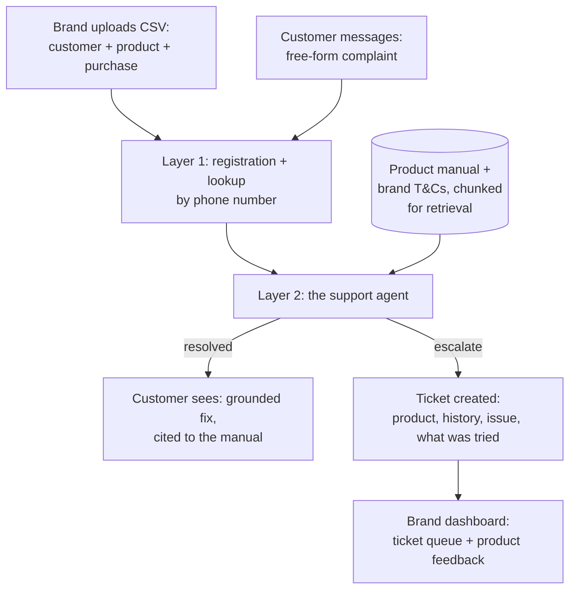

# Aftercare — Technical Plan

The how. Read `DESIGN.md` first for the what and why.

**Track: Build It.** No AWS account, no card, no bill — built entirely on AWS's own open-source stack, run locally:

| Tool | Used for |
|---|---|
| **Strands Agents SDK** | Orchestrates the support agent (Layer 2) against a local model via Ollama |
| **Cedar** | Authorizes brand dashboard access — each brand's staff can only ever see their own tickets, enforced by a real Cedar policy evaluation, not an `if` statement (`policies/dashboard.cedar`, `src/authz/cedar_authz.py`) |
| **AWS SAM Local** | Runs the core API as local Lambda functions behind an emulated API Gateway, proving the same logic is serverless-ready without deploying anywhere |
| **OpenSearch** | Backs the manual/terms retrieval with real BM25 search instead of a naive keyword-overlap function, run as a local single-node container |

Plain local Python stands in for the rest of what would otherwise be Lambda/DynamoDB, rather than literally routing through LocalStack — see the reasoning in our earlier build, still holds here.

---

## 1. The pipeline



## 2. What each piece does

| Component | Job | Why |
|---|---|---|
| Registration store | Product + customer + warranty records | Deterministic, no model needed — a lookup and some date math |
| Manual store | Each product's manual, chunked | The thing that makes a suggestion grounded instead of generic |
| Strands agent + local model | Reads the complaint, retrieves the relevant manual chunk, extracts structured fields, generates a grounded suggestion or decides to escalate | The actual agent — the flagship mechanism |
| Ticket store | Escalated complaints with full context | What the brand dashboard reads from |
| Customer chat UI | Simulated WhatsApp-style conversation | Real logic, simulated channel — see `DESIGN.md` §8 for why |
| Brand dashboard | Ticket queue, product feedback, warranty overview — scoped to one brand, Cedar-authorized | The other half of the two-sided story. Aftercare is one backend serving several brands; a brand's dashboard must never see another's data |

## 3. Data model

This section was the pre-build sketch. It drifted from what actually
got built (no `chunk_id`, no `brand_id` field, a two-part warranty
model this didn't anticipate) and stayed unfixed for a while — caught
in a later audit pass. **`FLOW.md` §6 has the real dataclasses,
field-for-field; this is the short version:**

- **Registration** — one per product a customer owns, loaded from a
  CSV fixture. No `brand_id` column — brand is derived from
  `product_id`'s prefix (`catalog.py`), not stored. Warranty status is
  two-part (a component warranty — motor or compressor, product-type
  dependent — and a flat 1-year parts warranty), computed at load
  time, never by the model.
- **Conversation / Turn** — one JSON file per conversation
  (`data/conversations/`), not a per-message row. Holds the full turn
  history, the retrieved section, which retrieval method actually
  answered, and an optional final `Ticket`.
- **Ticket** — one JSON file per ticket (`data/tickets/`), created
  only on escalation, carrying `product_id` so a brand's dashboard can
  filter to its own tickets only.

**`manuals`/`terms`** aren't chunked into a table at all — they're
markdown files (`fixtures/`), split into `(heading, body)` sections at
retrieval time and indexed into OpenSearch as-is (`{path, heading,
body}`). See `FLOW.md` §5.

## 4. The support agent, concretely

The core loop, specified the same way we specified M.1 last time — because the discipline of writing it out precisely is what made that one reliable:

1. **Look up the registration** by phone number — product, purchase date, warranty status (computed, never by the model — see Phase 1's result below), prior conversation if any.
2. **Read the complaint.** Check first, before anything else, for safety-relevant language (sparking, burning smell, exposed wiring, gas, shock) — a keyword/pattern check runs *before* the model touches it.
3. **If not safety-flagged:** decide whether this is a coverage question (retrieve from that brand's terms) or a troubleshooting question (retrieve from that product's manual), retrieve the most relevant section (real OpenSearch BM25 search now, with a keyword-overlap fallback if it's unreachable — keyword overlap was the original Phase 1 mechanism, still validated, see `IMPLEMENTATION.md`), and generate **one specific, doable-by-hand step**, not a full list — the manuals are written with an explicit "step 1, step 2, escalate" progression specifically so the agent hands these out one at a time, not all at once.
4. **Send that one step, and stop — wait for the customer's reply**, rather than assuming it worked.
5. **On their reply:** confirms resolved → close out, log as self-resolved, no ticket. Still broken and the manual has a next step (cap: two self-service attempts total) → send that one. Still broken and the manual has no more steps, or the symptom matches what the manual flags as not self-fixable → escalate.
6. **Escalate** with a ticket containing the product, history, the exact complaint, and exactly which steps were already tried and didn't work.

This is a genuinely different shape from M.1's loop in our first build — that one drilled deeper on a single question to test understanding; this one hands out real-world actions one at a time and only escalates once self-service has actually been tried, not skipped.

**Retrieval:** BM25 (OpenSearch), not embeddings — the original Phase 1 mechanism was keyword overlap, validated against a real, deliberately-similar-sounding pair of complaints (see `IMPLEMENTATION.md`); OpenSearch replaced the scoring mechanism later without relitigating that no need for embedding infrastructure given that result, and keyword overlap is now the honest fallback if OpenSearch is unreachable.

## 5. API, as actually built

This was also a pre-build sketch (`/register`, `/message`,
`/tickets/{brand_id}`) that never matched the real routes — registration
happens by loading a CSV fixture, not a `/register` call, since there's
no real point-of-sale integration in this build. The real routes,
served identically by Flask (`src/webapp/app.py`) and by SAM Local
(`src/lambda_handlers.py`, same logic in `src/webapp/api_core.py`):

```
GET  /api/customers                         -> [ { phone, name }, ... ]
POST /api/lookup        { phone }           -> { found, customer_name, brand, products[] }
POST /api/start         { phone, complaint } -> { conversation_id, status, message, ticket_id? }
POST /api/respond       { conversation_id, reply } -> { status, message, ticket_id? }
GET  /api/dashboard/{brand}   [X-Staff-Brand header] -> { tickets[], warranty_counts, product_feedback[], registered_count }
                              -- 403 if Cedar denies the staff_brand/brand pair, 503 if Cedar's unreachable
```

Full request-by-request behavior in `FLOW.md` §2.

## 6. Build order

1. **Before anything else:** the de-risking test — feed the agent a real complaint against a real (authored-for-this-demo) product manual, check it grounds the suggestion correctly and escalates when it should. Test both retrieval approaches here.
2. Layer 1: registration store + phone-number lookup + warranty math.
3. Layer 2: the full agent loop, wired to the local model via Strands.
4. A basic ticket view for the brand (the smallest complete, demoable story).
5. The customer-facing chat UI, styled like the real conversation it stands in for.
6. The brand dashboard's product-feedback aggregation, and UI polish generally — this build is also competing for Best UI, so this step is not optional if time allows.

## 7. Real vs. mocked, honestly

**Fully real:** the registration data (we author it, but it's structured and real once entered), the agent's retrieval-and-grounding logic, the escalation decision, the full conversation log.

**Authored for the demo, not fetched from anywhere:** each product's manual, its brand's terms & conditions, and the sales records — realistic, not real, written for the two fully-onboarded brands in this demo, since there's no public API for any of these the way GitHub gave us commits.

**Simulated, and said so in the video:** the WhatsApp channel itself — a styled web chat UI stands in for it. The logic behind it is real.

## 8. Demo script

1. Open on the real, felt moment: re-explaining your product to support from scratch, every single time.
2. **The before:** a real screenshot of a well-known appliance brand's actual support page — logo blacked out, since we're not naming them — showing the genuine broken or maze-like experience (a form that doesn't submit, a phone tree that goes nowhere). This is the contrast the whole pitch rests on, so it comes first, not last.
3. **The after:** show registration happening invisibly at the point of sale — customer does nothing.
4. A washing-machine drum-noise complaint, in the customer's own words. Show the agent give one real step (check it's level, spread the load), wait for a reply, and close it out — resolved, no ticket, no human involved.
5. An AC cooling complaint that isn't fixed by the first step — show the second, different step offered, and this time it's still broken: show it escalate with exactly what was already tried, not a guess dressed up as a third attempt.
6. A safety-flagged complaint (burning smell) — show the immediate escalation, zero troubleshooting attempt.
7. Switch to the brand dashboard: the ticket, full context attached, plus the product-feedback view showing a recurring issue.
8. Close on what a plain support inbox can never produce: a system that gets smarter about the product with every conversation, because it's the same system every time.
