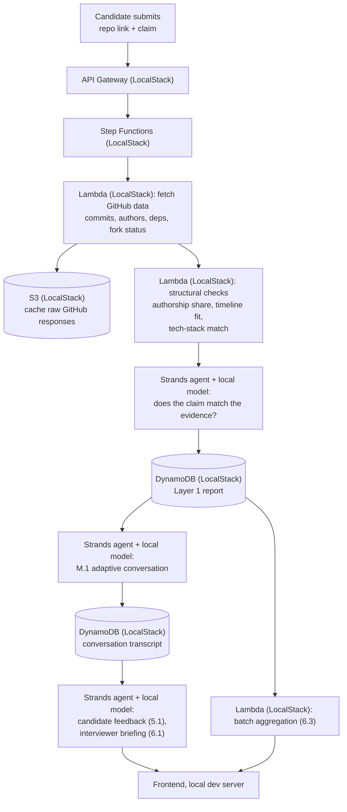

# Groundtruth — Technical Plan

The how. Read `DESIGN.md` first for the what and why — this is the pipeline underneath it.

**Track: Build It.** No AWS account, no billing — everything below runs on our own machine, using AWS's own local tooling. This is still genuinely "Built on AWS": Strands Agents SDK, SAM CLI + LocalStack, and Cedar are all AWS technology, just not billed cloud services.

---

## 1. The pipeline



Same shape as a real cloud deployment would have — that's deliberate. Every box here is the AWS-equivalent component, just run through LocalStack or a local model instead of a billed endpoint. If AWS access comes through mid-build, this maps onto Ship It with no redesign, only a config change.

## 2. What each piece does

| Component | Job | Why this one |
|---|---|---|
| Frontend, local dev server | Serves the app during development and the demo recording | No Amplify account needed; a local server is the honest Build It equivalent |
| API Gateway + Lambda (LocalStack) | Takes requests, starts the pipeline | Same request-shaped architecture as a real deployment, running on localhost |
| Step Functions (LocalStack) | Runs Layer 1's steps in order, retries on failure | Real sequential dependencies — can't check a claim before fetching the repo |
| Lambda — fetch | Calls the GitHub REST/GraphQL API | Public data, no auth wall — real inputs, not mocked, regardless of track |
| Lambda — structural checks | Authorship share, commit-timeline shape, dependency-file match | Deterministic, no model needed, nothing to hallucinate |
| Strands agent + local model — claim match | Reads the claim next to real code and commit samples, judges plausibility | The one step needing actual judgment; Strands is what the Build It track gives us for this |
| Strands agent + local model — M.1 | Generates each question grounded in the Layer 1 report, reads the answer, decides the next step | The adaptive core — retrieve real evidence, add to context, generate the next question |
| DynamoDB (LocalStack) | Stores the Layer 1 report and the full M.1 transcript | Cache for speed, and the actual audit record |
| S3 (LocalStack) | Caches raw GitHub responses; stores generated reports as artifacts | Same role a real S3 bucket would play |
| Strands agent + local model — 5.1 / 6.1 / 6.2 | Turns stored evidence, plus transcript, plus human interview notes for 6.2, into readable text | Same evidence, three different audiences |
| Lambda — 6.3 | Aggregates per-candidate reports across a batch | A query and a sort over what already exists |
| Cedar | Optional: a policy defining what a "candidate" role can see versus a "company" role | Lowest priority — only if 1 through the above already work, and only because it's a real, better-fitting Build It alternative to needing Cognito |

**The local model, specifically.** This is the one new, real risk the pivot introduces, worth naming directly: a model running on our own machine is very likely weaker than a hosted frontier model at the exact judgment call M.1 depends on — telling a genuine explanation from a generic one. Pick a strong, currently-capable local model (run through Ollama or an equivalent Strands supports), keep prompts tight and evidence-grounded rather than open-ended, and — per `DESIGN.md`'s build order — test this specific model on this specific task before building anything on top of it. If it isn't good enough, the fallback is a smaller, more constrained version of the same judgment call (e.g., a shorter, more structured answer format), not a different architecture.

**PartyRock, mentioned for completeness.** It's in Build It's toolkit and gives free access to real Bedrock foundation models without an AWS account. Worth a quick look if the local model underperforms — but it's built as a standalone, no-code app, not something we're confident can be called as an API from inside our own system. Don't bet the architecture on it without testing that first.

## 3. Data model

Unchanged by the pivot — three LocalStack-emulated DynamoDB tables:

**`reports`** — one item per candidate submission.
`candidate_id` (partition key) · `repo_url` · `claim_text` · `layer1_status` (verified / plausible / inconsistent / insufficient) · `layer1_evidence` (list of {claim, status, evidence, source_commit}) · `created_at`

**`conversations`** — one item per M.1 run, linked to a report.
`candidate_id` (partition key) · `turn_number` (sort key) · `question` · `grounded_commit` · `answer` · `answer_score` · `next_action` (drill_deeper / move_on / end)

**`decisions`** — one item per company-side outcome, written at 6.2.
`job_id` (partition key) · `candidate_id` (sort key) · `rank_bucket` (confirmed_good / not_enough_evidence / confirmed_bad) · `interviewer_notes` · `interview_transcript` · `final_reasoning` · `decided_at`

## 4. The M.1 adaptive loop, concretely

The flagship mechanism, unchanged in logic — only the model underneath changed:

1. **Pick a starting point.** From the Layer 1 report, the most substantial commit — largest genuine diff, or one already flagged `plausible` rather than `verified`.
2. **Ask a broad question about it**, grounded in the real diff and commit message.
3. **Score the answer**, roughly 1–5: does it reference specifics that actually match the code, does it explain reasoning rather than describe the surface. Never shown to the candidate — see the fairness rule against exposing thresholds in `DESIGN.md`.
4. **Decide the next step.** Low score → a tighter follow-up on the same point. High score → move to a different part of the repo. Cap at four to six turns, so it stays short by design.
5. **Stop and summarize.** The transcript and a plain-language read of it join the same report from Layer 1 — never a separate document.

## 5. API sketch

```
POST /submit
  { repo_url, claim_text }
  → { candidate_id, status: "processing" }

GET /report/{candidate_id}
  → { layer1: {...}, conversation: [...], overall: "confirmed_good" | "not_enough_evidence" | "confirmed_bad" }

POST /decision/{job_id}/{candidate_id}
  { interviewer_notes, interview_transcript }
  → { decision_id, final_reasoning }

GET /rank/{job_id}
  → [ { candidate_id, overall, headline_evidence }, ... ]   # powers 6.3
```

Unchanged by the pivot — these are the same four endpoints, just served from LocalStack instead of real API Gateway.

## 6. Build order

Matches `DESIGN.md`'s build order and `SKILL.md`'s build methodology:

1. **Before any infrastructure, real or emulated:** a plain script proving the M.1 loop above, against the actual local model — can it tell a real explanation from a generic one, grounded in one real commit. The experiment that de-risks everything else, and now the one most likely to surprise us.
2. Layer 1 wired to Strands, the local model, and LocalStack's DynamoDB.
3. Layer 2 — the full M.1 loop; M.2 as the fallback if M.1 isn't landing well, whether that's a design problem or a model-quality one.
4. A basic 6.3 (ranked list) and 6.1 (briefing) — the smallest complete, demoable company-side story.
5. 5.1 (candidate feedback) and full 6.2 (human-interview transcript folded in).
6. Polish 6.3 and the UI generally, only if there's time left — this now also directly serves Best UI, not just a nice-to-have.

## 7. Real vs. mocked, honestly

**Fully real:** GitHub data, the structural checks, the local-model claim-matching and M.1 conversation, the whole system running end to end on our own machine.

**Simplified for time:** claim entry is a short structured form, not a resume PDF upload. Fork-copy detection checks a fork against its own parent only, not every public repo.

**Simulated, and said so in the video:** the "human interviewer" step feeding 6.2 — we write a short, plausible interview transcript ourselves rather than staging a real interview. Everything upstream — Layers 1–2, 6.1, 6.3 — runs on real data.

## 8. Demo script

1. Open on the real stat: entry-level postings up 47%, real junior hiring in them down 73%.
2. Submit a real repo with an exaggerated claim, running locally — show it get caught, with the specific evidence.
3. Submit a genuine, honest project — show it verified, then walk through the M.1 conversation live.
4. Show 6.3's ranked view and 6.1's briefing for that candidate.
5. Show 6.2's combined decision record, transcript included.
6. Close on: this is the layer that has to exist before anything downstream — interviews, hiring decisions, fast-track selection — can be trusted. Runs entirely on this laptop, right now, with nothing rented from anyone.
