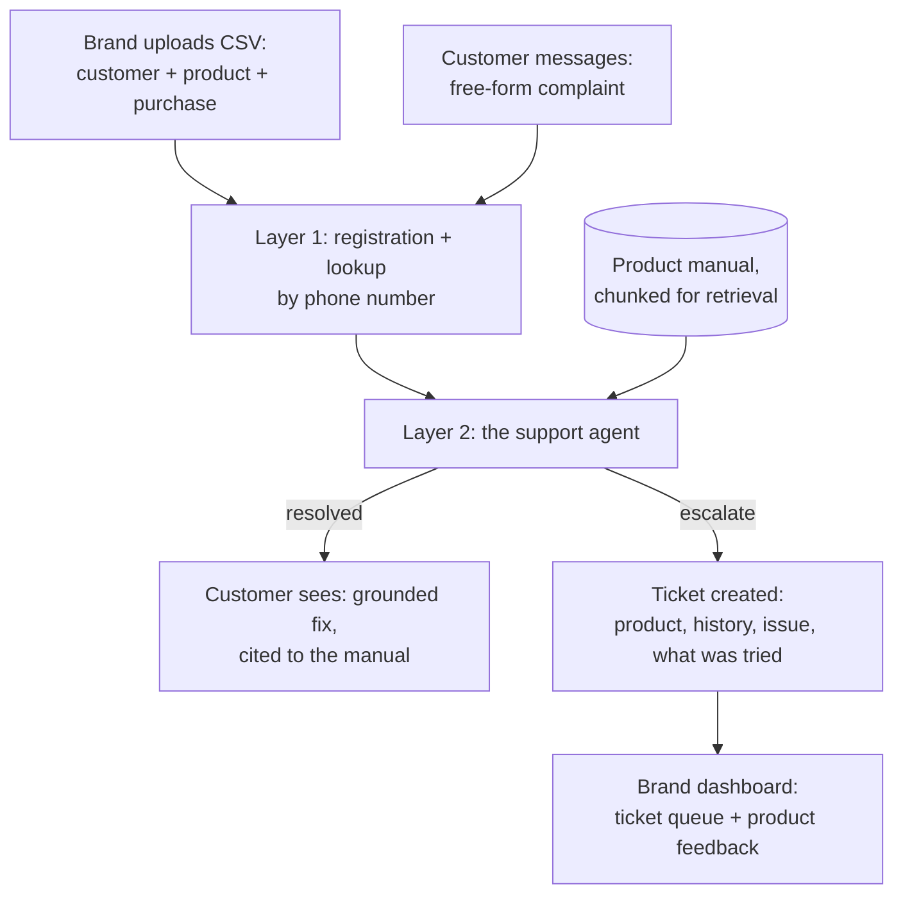

# Aftercare — Technical Plan

The how. Read `DESIGN.md` first for the what and why.

**Track: Build It.** Same approach as our first build: no AWS account, Strands Agents SDK orchestrating a local model via Ollama, plain local Python standing in for the AWS services it maps onto (Lambda, DynamoDB) rather than literally routing through LocalStack — see the reasoning in our earlier build, still holds here.

---

## 1. The pipeline



## 2. What each piece does

| Component | Job | Why |
|---|---|---|
| Registration store | Product + customer + warranty records | Deterministic, no model needed — a lookup and some date math |
| Manual store | Each product's manual, chunked | The thing that makes a suggestion grounded instead of generic |
| Strands agent + local model | Reads the complaint, retrieves the relevant manual chunk, extracts structured fields, generates a grounded suggestion or decides to escalate | The actual agent — the flagship mechanism |
| Ticket store | Escalated complaints with full context | What the brand dashboard reads from |
| Customer chat UI | Simulated WhatsApp-style conversation | Real logic, simulated channel — see `DESIGN.md` §8 for why |
| Brand dashboard | Ticket queue, product feedback, warranty overview | The other half of the two-sided story |

## 3. Data model

**`registrations`** — one row per product a customer owns.
`registration_id` (key) · `customer_phone` · `customer_name` · `brand_id` · `product_id` · `serial_number` · `purchase_date` · `retailer` · `warranty_end_date` · `warranty_status` (computed: active/expiring/expired)

**`manuals`** — chunked manual content per product, for retrieval.
`product_id` · `chunk_id` · `section_title` · `text`

**`conversations`** — one row per message exchanged.
`registration_id` · `turn_number` · `role` (customer/agent) · `message` · `grounded_chunk_id` (if any) · `extracted_fields` (issue type, duration, severity) · `safety_flag` (bool)

**`tickets`** — created only on escalation.
`ticket_id` · `registration_id` · `issue_summary` · `conversation_ref` · `status` (new/assigned/scheduled/resolved) · `created_at` · `resolution_notes`

## 4. The support agent, concretely

The core loop, specified the same way we specified M.1 last time — because the discipline of writing it out precisely is what made that one reliable:

1. **Look up the registration** by phone number — product, purchase date, warranty status, prior conversation if any.
2. **Read the complaint.** Check first, before anything else, for safety-relevant language (sparking, burning smell, exposed wiring, gas, shock) — a keyword/pattern check runs *before* the model touches it, because escalation on safety must never depend on the model choosing to notice.
3. **If not safety-flagged:** retrieve the most relevant manual chunk for this product given the complaint (embedding or keyword retrieval — see open question below), extract structured fields (issue type, duration, severity), and generate a suggestion — but only if the retrieved chunk actually addresses the issue. If nothing in the manual is clearly relevant, that's the signal to escalate, not a prompt to improvise.
4. **Score whether the suggestion is genuinely grounded** in the retrieved text, not just plausible-sounding, before sending it — same "score what was actually said against real evidence" discipline as our claim-matching work before.
5. **If resolved:** confirm with the customer. **If not, or safety-flagged, or ungrounded:** create a ticket with everything gathered so far.

**Open question, worth resolving with a quick test before building further:** keyword-based manual retrieval (fast, no embedding infra needed) versus embedding-based retrieval (better recall on paraphrased complaints, more setup). Test both against a real manual before committing — same "prove it before you build on it" rule as always.

## 5. API sketch

```
POST /register        { brand_id, customer_phone, customer_name, product_id, serial_number, purchase_date, retailer }
                       -> { registration_id, warranty_end_date }

POST /message          { registration_id, message }
                       -> { reply, resolved: bool, ticket_id: str | null }

GET  /tickets/{brand_id}
                       -> [ { ticket_id, product, issue_summary, status, created_at }, ... ]   # powers the brand dashboard

POST /tickets/{ticket_id}/status
                       { status, resolution_notes }
                       -> { updated: true }
```

## 6. Build order

1. **Before anything else:** the de-risking test — feed the agent a real complaint against a real (authored-for-this-demo) product manual, check it grounds the suggestion correctly and escalates when it should. Test both retrieval approaches here.
2. Layer 1: registration store + phone-number lookup + warranty math.
3. Layer 2: the full agent loop, wired to the local model via Strands.
4. A basic ticket view for the brand (the smallest complete, demoable story).
5. The customer-facing chat UI, styled like the real conversation it stands in for.
6. The brand dashboard's product-feedback aggregation, and UI polish generally — this build is also competing for Best UI, so this step is not optional if time allows.

## 7. Real vs. mocked, honestly

**Fully real:** the registration data (we author it, but it's structured and real once entered), the agent's retrieval-and-grounding logic, the escalation decision, the full conversation log.

**Authored for the demo, not fetched from anywhere:** the product manuals themselves — a small number of real-feeling appliance manuals, written for this build, since there's no public API for appliance manuals the way GitHub gave us commits.

**Simulated, and said so in the video:** the WhatsApp channel itself — a styled web chat UI stands in for it. The logic behind it is real.

## 8. Demo script

1. Open on the real, felt moment: re-explaining your product to support from scratch, every single time.
2. Show registration happening invisibly at the point of sale — customer does nothing.
3. A customer messages with a real complaint, in their own words. Show the agent ground a specific fix in the actual manual, cited.
4. A second case: a complaint the manual doesn't clearly cover — show it escalate honestly instead of guessing.
5. A third case: a safety-flagged complaint — show the immediate escalation, no troubleshooting attempt at all.
6. Switch to the brand dashboard: the ticket, full context attached, plus the product-feedback view showing a recurring issue.
7. Close on what a plain support inbox can never produce: a system that gets smarter about the product with every conversation, because it's the same system every time.
