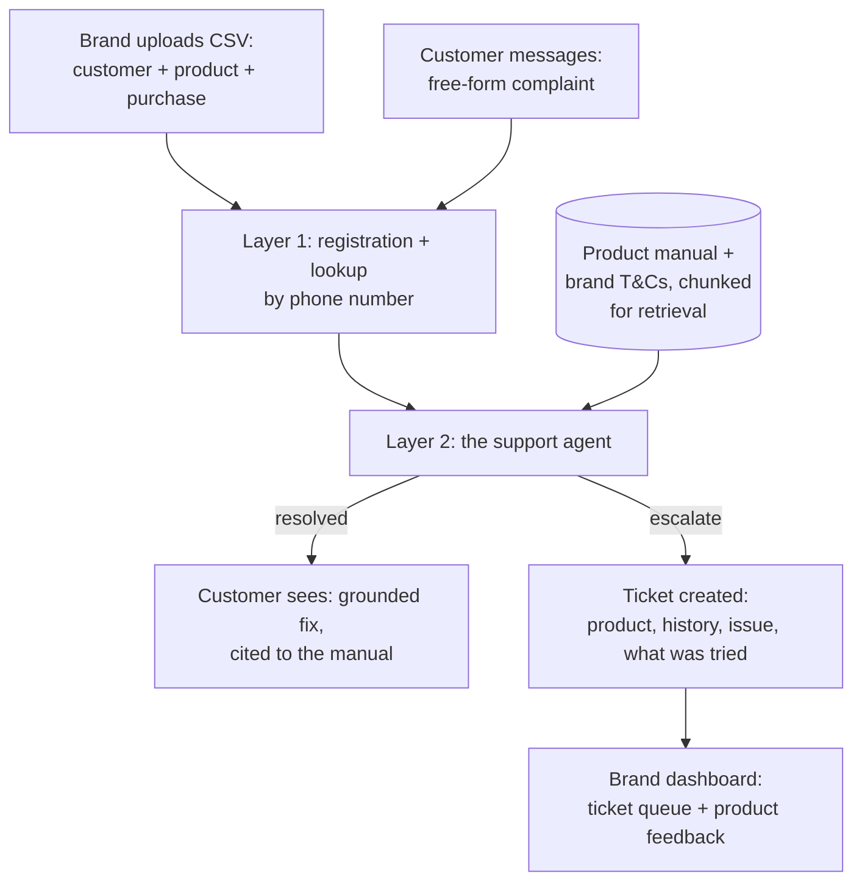

# Aftercare — Technical Plan

The how. Read `DESIGN.md` first for the what and why.

**Track: Build It.** No AWS account, no card, no bill — built entirely on AWS's own open-source stack, run locally:

| Tool | Used for |
|---|---|
| **Strands Agents SDK** | Orchestrates the support agent (Layer 2) against a local model via Ollama |
| **Cedar** | Authorizes brand dashboard access — each brand's staff can only ever see their own tickets, enforced by a real Cedar policy evaluation, not an `if` statement (`policies/dashboard.cedar`, `src/authz/cedar_authz.py`) |
| **AWS SAM Local** | Runs the core API as local Lambda functions behind an emulated API Gateway, proving the same logic is serverless-ready without deploying anywhere |
| **OpenSearch** | Backs the manual/terms retrieval with real BM25 search instead of a naive keyword-overlap function, run as a local single-node container |

Plain local Python stands in for the rest of what would otherwise be Lambda/DynamoDB, rather than literally routing through LocalStack — see the reasoning in our earlier build, still holds here.

---

## 1. The pipeline



## 2. What each piece does

| Component | Job | Why |
|---|---|---|
| Registration store | Product + customer + warranty records | Deterministic, no model needed — a lookup and some date math |
| Manual store | Each product's manual, chunked | The thing that makes a suggestion grounded instead of generic |
| Strands agent + local model | Reads the complaint, retrieves the relevant manual chunk, extracts structured fields, generates a grounded suggestion or decides to escalate | The actual agent — the flagship mechanism |
| Ticket store | Escalated complaints with full context | What the brand dashboard reads from |
| Customer chat UI | Simulated WhatsApp-style conversation | Real logic, simulated channel — see `DESIGN.md` §8 for why |
| Brand dashboard | Ticket queue, product feedback, warranty overview — scoped to one brand, Cedar-authorized | The other half of the two-sided story. Aftercare is one backend serving several brands; a brand's dashboard must never see another's data |

## 3. Data model

**`registrations`** — one row per product a customer owns.
`registration_id` (key) · `customer_phone` · `customer_name` · `brand_id` · `product_id` · `serial_number` · `purchase_date` · `retailer` · `warranty_end_date` · `warranty_status` (computed: active/expiring/expired)

**`manuals`** — chunked manual content per product, for troubleshooting questions.
`product_id` · `chunk_id` · `section_title` · `text`

**`terms`** — chunked terms & conditions per brand, for coverage/warranty questions.
`brand_id` · `chunk_id` · `section_title` · `text`

**`conversations`** — one row per message exchanged.
`registration_id` · `turn_number` · `role` (customer/agent) · `message` · `grounded_chunk_id` (if any) · `extracted_fields` (issue type, duration, severity) · `safety_flag` (bool) · `attempt_number` (which self-service step this is, capped at 2) · `outcome` (resolved / still_broken / escalated, set once the customer replies)

**`tickets`** — created only on escalation.
`ticket_id` · `registration_id` · `issue_summary` · `conversation_ref` · `status` (new/assigned/scheduled/resolved) · `created_at` · `resolution_notes`

## 4. The support agent, concretely

The core loop, specified the same way we specified M.1 last time — because the discipline of writing it out precisely is what made that one reliable:

1. **Look up the registration** by phone number — product, purchase date, warranty status (computed, never by the model — see Phase 1's result below), prior conversation if any.
2. **Read the complaint.** Check first, before anything else, for safety-relevant language (sparking, burning smell, exposed wiring, gas, shock) — a keyword/pattern check runs *before* the model touches it.
3. **If not safety-flagged:** decide whether this is a coverage question (retrieve from that brand's terms) or a troubleshooting question (retrieve from that product's manual), retrieve the most relevant chunk (keyword retrieval — validated in Phase 1, see `IMPLEMENTATION.md`), and generate **one specific, doable-by-hand step**, not a full list — the manuals are written with an explicit "step 1, step 2, escalate" progression specifically so the agent hands these out one at a time, not all at once.
4. **Send that one step, and stop — wait for the customer's reply**, rather than assuming it worked.
5. **On their reply:** confirms resolved → close out, log as self-resolved, no ticket. Still broken and the manual has a next step (cap: two self-service attempts total) → send that one. Still broken and the manual has no more steps, or the symptom matches what the manual flags as not self-fixable → escalate.
6. **Escalate** with a ticket containing the product, history, the exact complaint, and exactly which steps were already tried and didn't work.

This is a genuinely different shape from M.1's loop in our first build — that one drilled deeper on a single question to test understanding; this one hands out real-world actions one at a time and only escalates once self-service has actually been tried, not skipped.

**Retrieval:** keyword overlap, not embeddings — validated against a real, deliberately-similar-sounding pair of complaints in Phase 1 (see `IMPLEMENTATION.md`), no need for embedding infrastructure given that result.

## 5. API sketch

```
POST /register        { brand_id, customer_phone, customer_name, product_id, serial_number, purchase_date, retailer }
                       -> { registration_id, warranty_end_date }

POST /message          { registration_id, message }
                       -> { reply, resolved: bool, ticket_id: str | null }

GET  /tickets/{brand_id}
                       -> [ { ticket_id, product, issue_summary, status, created_at }, ... ]   # powers the brand dashboard

POST /tickets/{ticket_id}/status
                       { status, resolution_notes }
                       -> { updated: true }
```

## 6. Build order

1. **Before anything else:** the de-risking test — feed the agent a real complaint against a real (authored-for-this-demo) product manual, check it grounds the suggestion correctly and escalates when it should. Test both retrieval approaches here.
2. Layer 1: registration store + phone-number lookup + warranty math.
3. Layer 2: the full agent loop, wired to the local model via Strands.
4. A basic ticket view for the brand (the smallest complete, demoable story).
5. The customer-facing chat UI, styled like the real conversation it stands in for.
6. The brand dashboard's product-feedback aggregation, and UI polish generally — this build is also competing for Best UI, so this step is not optional if time allows.

## 7. Real vs. mocked, honestly

**Fully real:** the registration data (we author it, but it's structured and real once entered), the agent's retrieval-and-grounding logic, the escalation decision, the full conversation log.

**Authored for the demo, not fetched from anywhere:** each product's manual, its brand's terms & conditions, and the sales records — realistic, not real, written for the two fully-onboarded brands in this demo, since there's no public API for any of these the way GitHub gave us commits.

**Simulated, and said so in the video:** the WhatsApp channel itself — a styled web chat UI stands in for it. The logic behind it is real.

## 8. Demo script

1. Open on the real, felt moment: re-explaining your product to support from scratch, every single time.
2. **The before:** a real screenshot of a well-known appliance brand's actual support page — logo blacked out, since we're not naming them — showing the genuine broken or maze-like experience (a form that doesn't submit, a phone tree that goes nowhere). This is the contrast the whole pitch rests on, so it comes first, not last.
3. **The after:** show registration happening invisibly at the point of sale — customer does nothing.
4. A washing-machine drum-noise complaint, in the customer's own words. Show the agent give one real step (check it's level, spread the load), wait for a reply, and close it out — resolved, no ticket, no human involved.
5. An AC cooling complaint that isn't fixed by the first step — show the second, different step offered, and this time it's still broken: show it escalate with exactly what was already tried, not a guess dressed up as a third attempt.
6. A safety-flagged complaint (burning smell) — show the immediate escalation, zero troubleshooting attempt.
7. Switch to the brand dashboard: the ticket, full context attached, plus the product-feedback view showing a recurring issue.
8. Close on what a plain support inbox can never produce: a system that gets smarter about the product with every conversation, because it's the same system every time.
